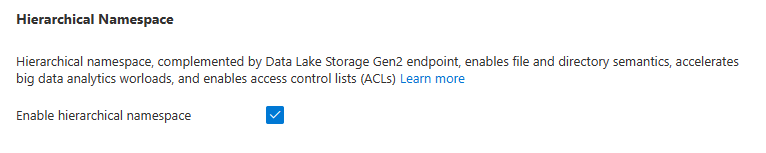
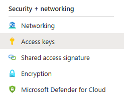

# Emrick Blob Service for ASP.NET Core

## Summary 

The Emrick Blob Service is a .NET class that encapsulates [Azure Blob Storage](https://azure.microsoft.com/en-us/products/storage/blobs) functionality in an easy-to-use class.

Connecting a .NET application to Azure Storage can be complex and intimidating.  Using my BlobService.cs class will quickly get you connected and performing common tasks like uploading, downloading, or simply browsing the files in your Azure Storage containers.

[Sample web applications](#sample-applications) for both MVC and Razor Pages are available that demonstrates the use of the Blob Service.

## Prerequisites to use my Blob Service

Before you can get started using my Blob Service, there are three things that need to happen first.

1.  You must have an existing or new ASP.NET Core web application.  The BlobService class will work with either the MVC or Razor Pages template.

2.  The [Azure.Storage.Blobs](https://www.nuget.org/packages/Azure.Storage.Blobs) and [Azure.Identity](https://www.nuget.org/packages/Azure.Identity) NUGET packages need to be added to your project.  

    Use the Manage NUGET Packages tool in Visual Studio or use the following CLI commands:

        dotnet add package Azure.Storage.Blobs  
        dotnet add package Azure.Identity

3.  Add the BlobService.cs file to your project.  This can be anywhere, but my preference is to create a Services folder and add the BlobService.cs file there.

## A Very Simple Example (Quickstart)

The following is a practical example of how to use my BlobService to retrieve a list of files.

First, instantiate and authenticate to your container.  In this example, I am using the Connection String method.  I have logged into the Azure Portal, and copied the connection string from the Access Keys page of the Storage Account.

    string BlobConnectionString = 
        "DefaultEndpointsProtocol=https;AccountName=StevesStorageAccount;AccountKey=REDACTED==;EndpointSuffix=core.windows.net";

    Emrick.CStringBlobService blobService = 
        new Emrick.CStringBlobService(BlobConnectionString, "file-uploads");

Note that the constructor takes both the connection string AND the name of the container.

Next, we simply call the GetContentsOfFolder method.  This method returns a List of file names in the specified folder path.

    List<string> listOfFiles = 
        blobService.GetContentsOfFolder(filePath);

## Blob Service Methods

These five simple methods will allow you to interact with your files in Azure Blob Storage.

|Method Name|Description|
|---|---|
|`List<string> GetContentsOfFolder(string folderPath)`|Retrieves a list of file names in the specified folder.|
|`System.IO.Stream GetFile(string filePath)`|Retrieves the specified file.|
|`void DeleteFile(string filePath)`|Deletes the specified file.
|`void DeleteFolderAndContents(string folderPath)`|Deletes the specified folder and all contents.|
|`public void UploadFile(string destinationFilePath, Stream fileData, bool overwrite = false)`|Uploads a specified file.|

## About Azure Blob Storage

<https://learn.microsoft.com/en-us/azure/storage/blobs/storage-blobs-introduction>

Azure Blob Storage is Microsoft's cloud storage service for files.  For our purposes, just think of the word "blob (binary large object)" as just another word for a file.  

OneDrive and SharePoint also provide the capability to store files, but the use cases are different.  OneDrive and SharePoint are applications that allow individual users to create, collaborate, and interact with their files.  Azure Blob Storage is simply a place to securely store a massive amount of documents for a relatively cheap cost.

It's an attractive option if you are developing a .NET application that either uploads or retrieves documents on a massive scale.

## Azure Requirements

Trying out Azure Blob Storage is free and fairly straight-forward.  I will walk through each step to configure an account for storing blobs.  Essentially, there are three steps:

1.  Create an Azure account if you don't already have a subscription.
2.  Create a "storage account".
3.  Create a "container" within your storage account.

### Create an Azure Account

Even if your organization has an Azure subscription, I think it's a good idea to go ahead and create your own account using your personal email.  This gives you your own tenant for which you have complete control and is great for experimenting.  It's free as long as you don't use more than the free limits.  Click below to get started.

<https://azure.microsoft.com/en-us/free/>

### Create an Azure Storage Account

Once you have an Azure account, sign in to the Azure Portal at <https://portal.azure.com/>.  Click "Create a resource", then choose the "Storage" category, and "Storage Account".  The following links provides pretty clear instructions on how to do this.

<https://learn.microsoft.com/en-us/azure/storage/common/storage-account-create>

As you work your way through the screens to create the storage account, make sure you enable hierarchical namespace.  This will allow you to perform operations on files at the folder level:

### Create a Blob Container

After the storage account is created, the account will appear on the portal home page under resources.  Click the storage account.  Then select Containers from the menu on the right side of the screen.  Click the "+ Container" button to add a new container.  The link below provides more details.

<https://learn.microsoft.com/en-us/azure/storage/blobs/blob-containers-portal>

Think of the container as like a drive to store the files.

## Instantiate my Blob Service

The Blob Service is exposed using 3 derived classes depending on what method of authentication you are planning to use to access your blob storage.

### Authenticate Using a Connection String

<https://learn.microsoft.com/en-us/azure/storage/blobs/authorize-access-azure-active-directory#:~:text=Use%20of%20access,to%20Azure%20resources.>

This is known an "shared key" authentication.  As the above link shows, Microsoft does not recommend it for production scenarios.  *However, it is the easiest to get up and running for a quick proof of concept.*

The connection string containing both the key and the URL to your storage account can be found on the Azure Portal.  First, navigate to your storage account, and select the "Access keys" option in the menu.  From here, you can easily copy the connection string to use in your code.

All of the Blob Service code is encapsulated in a class named "BlobService" within the "Emrick" namespace.  When authenticating using a connection string, the BlobService code is accessed through a derived class named **CStringBlobService**.

Instantiate the CStringBlobService class by providing the constructor with the connection string and the name of the blob container as follows:

    
    string BlobConnectionString = 
        "DefaultEndpointsProtocol=https;AccountName=StevesStorageAccount;AccountKey=LONGUGLYKEYASDFASDF==;EndpointSuffix=core.windows.net";

    Emrick.CStringBlobService blobService = 
        new Emrick.CStringBlobService(BlobConnectionString, "file-uploads");

### Authenticate Using a Client ID and Secret

This method involves registering the .NET application in Azure Active Directory and getting a set of credentials to authenticate your app with the Azure storage account.

Follow the steps at the link below to register your app and create a client secret:

<https://learn.microsoft.com/en-us/dotnet/azure/sdk/authentication-on-premises-apps?tabs=azure-portal%2Cwindows%2Ccommand-line#:~:text=An%20app%20can%20be%20registered%20with%20Azure%20using%20either%20the%20Azure%20portal%20or%20the%20Azure%20CLI.>

Then give your application the Storage Blob Data Contributor role as described in the same article at the link below:

<https://learn.microsoft.com/en-us/dotnet/azure/sdk/authentication-on-premises-apps?tabs=azure-portal%2Cwindows%2Ccommand-line#:~:text=This%20example%20will%20show%20how%20to%20assign%20roles%20for%20the%20service%20principal%20at%20the%20resource%20group%20scope%20since%20most%20applications%20group%20all%20their%20Azure%20resources%20into%20a%20single%20resource%20group.>

When authenticating using a client id and secret, the BlobService code is accessed through a derived class named **ClientSecretBlobService**.

    string AzureStorageUrl = 
        "https://<Name Of Storage Account>.blob.core.windows.net";
    string ContainerName = "<Name of Container>";
    string TenantId = "<Tenant ID from Azure Portal>";
    string ClientId = "<Client ID from Azure Portal>";
    string ClientSecret = "<Client Secret from Azure Portal>";

    Emrick.ClientSecretBlobService blobService = 
        new Emrick.ClientSecretBlobService(
        AzureStorageUrl, ContainerName, TenantId, ClientId, ClientSecret);

**AzureStorageUrl** can be found on the Azure Portal.  Select the storage account, then choose Endpoints in the menu on the left.  The Primary Endpoint is what this is.

**ContainerName** is the name you gave the container when you created it.

**TenantId** is the GUID that represents the tenant and can be found on the Azure Portal.  Select Azure Active Directory and it will show on the Overview page.

**ClientId** is the GUID that was generated when you followed the Microsoft instructions for registering an application.

**ClientSecret** is the secret that was generated when you followed the Microsoft instructions for registering an application.

### Authenticate using the Default Azure Credential

The [Default Azure Credential](https://learn.microsoft.com/en-us/dotnet/api/overview/azure/identity-readme?view=azure-dotnet&preserve-view=true#defaultazurecredential) will locate your credentials automatically from a variety of locations.  The best use of this method is when developing a proof of concept application where you are logged into Visual Studio with the same credentials that have access to the Azure Blob Storage container.

This method can also find your credentials in operating system environment variables if you wish to store them there.

When authenticating using this method, the BlobService code is accessed through a derived class named **DefaultBlobService**.

    string AzureStorageUrl = 
        "https://<Name Of Storage Account>.blob.core.windows.net";
    string ContainerName = "<Name of Container>";

    Emrick.DefaultBlobService blobService = 
        new Emrick.DefaultBlobService(AzureStorageUrl, ContainerName);

# Sample Applications

The sample application provides examples of how to do the most common actions using the Blob Service.  A sample application is provided for both the Razor Pages and MVC web application syntax depending on your preference.  

To use a sample, simply open the .csproj file using Visual Studio, or open the folder if you prefer Visual Studio Code.

Before running the project, open the appsettings.json file.  Locate the following section:

    "Emrick": {
        "BlobService": {
            "ConnectionString": "",
            "AzureStorageUrl": "",
            "ContainerName": "",
            "TenantId": "",
            "ClientId": "",
            "ClientSecret": ""
        }
    }

To run the sample application in it's simplest configuration, you must supply a value for the ConnectionString and ContainerName values.  To find the connection string, see the [Authenticate Using a Connection String](#authenticate-using-a-connection-string) section.

The application opens to a menu providing links to 3 screens:

| Page | Description |
| ---- | ----------- |
| Files | Demonstrates browsing, downloading, viewing, and deleting       files from an Azure storage account. |
| Upload | Demonstrates uploading a single file to an Azure storage account. |
| UploadMultiple | Demonstrates uploading multiple files to an Azure storage account. |

